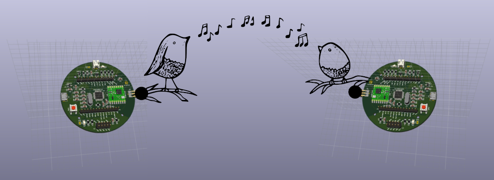

# librelab::Big Dot



> A SAML21-based board for your environmental sensing projects!

## Description

In this repository you will find the design and firmware files for librelab::Big Dot, our libre hardware kit for low-energy LoRa applications. The content in this repo is organized in the following way:

```bash
├── arduino-core (support files)
│   ├── bossa
│   └── librelab
├── board (hardware design)
│   ├── datasheets
│   ├── lib
│   └── output
├── bootloader (firmware files)
│   ├── bootloaders
│   ├── openocd-conf
│   └── sketches
└── examples (applications)
    ├── fastled-ultrasonic
    └── ttn-pm-co2
```

## Installation

### Arduino support

To install the support files for our board on your system, just include the following line in the field 'Additional Boards Manager URL' (under 'Preferences' menu) of the Arduino IDE:

```
https://unixjazz.org/pub/software/package_librelab_index.json
```

We are using the Arduino SAMD core (v1.6), but forked and modified to add support for the chip [SAML21 developed by Mattair](https://github.com/mattairtech/ArduinoCore-samd). You will need Arduino 1.8.13 or superior to use this core with our board.

If you need further instructions on how to install the Arduino core, [follow this link](https://www.arduino.cc/en/guide/cores).

### Micropython support

_Coming up!_

## Prototyping

If you do not have a Big Dot board at hand, you can use a SAML21 Xplained board for testing purposes. The information on how to flash the bootloader we use can be found in the [bootloader directory](bootloader/README.md). For your convenience, we also included pre-compiled firmware files in this repo as well.

## Project info

Our hardware kit was funded by the "Network Public Spaces" (NPS) project at University of Virginia. NPS is a collaborative project involving the School of Data Science and the School of Architecture for the study and implementation of community-based environmental sensor networks. For more info, check out the [project website](https://example.com).

## License

All the documentation is released as CC-BY-4.0-International.
All the hardware code is released under CERN-OHL-v2 Strongly Reciprocal.
All software code is released under GPL v3, unless marked otherwise on the source file headers. See LICENSE and AUTHORS files for further information.

OSHW certification: _pending_.

__Happy hw hacking!__
