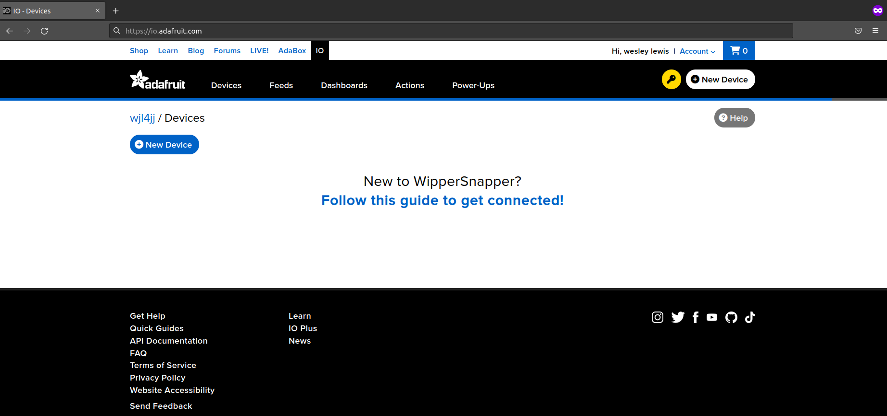
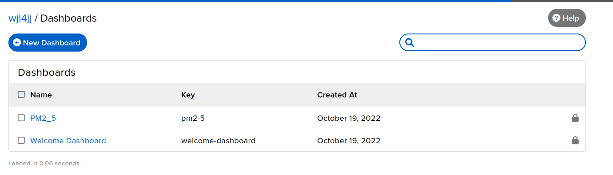
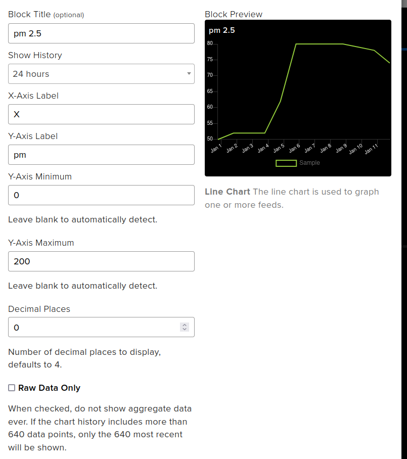
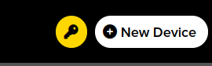
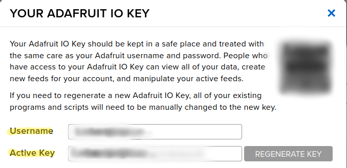
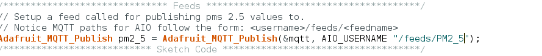
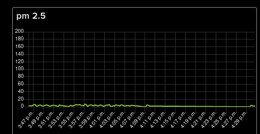

# Getting Started With Arduino

**You must add the URL from the 'Arduino support section' before proceeding**

Open Arduino IDE->Tool->Board and click on Board Manager. In the search bar, type "Big Dot" then download "librelab::Big Dot by UVA SDS". Now that you have the board downloaded, to select the board go to Tools->Board->librelab::Big Dot and select Big Dot. Now Select the port, Tools->Port->(Select the port that says BigDot, i.e., "COM3 BigDot").
Now you've downloaded and selected the Big Dot!
Don't forget about the port!

**You must add the URL from the Arduino support section before you begin this section**

## Hello World!

In your Arduino IDE, select File->Examples->01.Basics and click on Blink. To upload code to BigDot, you must first press the RESET button twice. You'll know you're ready to upload code when the LED is pulsing. Once the LED is pulsing from pressing the reset button twice, click on the upload button (Arrow pointing to the right). Congrats! You should see the LED turn on and off every second.
## Required Libraries
Please download the zip files below
1. [SparkfunBME280](https://github.com/Wesleylewis05/SparkFun_BME280_Arduino_Library)
2. [U8g2lib](https://github.com/Wesleylewis05/U8g2_Arduino)
3. [PMS7003](https://github.com/Wesleylewis05/PMS)
4. [Lmic](https://github.com/Wesleylewis05/arduino-lmic)
5. [ArduinoLowPower](https://github.com/Wesleylewis05/ArduinoLowPower)
7. [RTCZero](https://github.com/Wesleylewis05/RTCZero)
7. [Adafruit Neopixel](https://github.com/Wesleylewis05/Adafruit_NeoPixel)
8. [Sam32wifiesp](https://github.com/Wesleylewis05/SAM32WiFiEsp)
9. [PubSubClient](https://github.com/Wesleylewis05/pubsubclient)
10. [AdafruitMQTT](https://github.com/Wesleylewis05/Adafruit_MQTT_Library)

Once you've downloaded everything uploads the files in your IDE. In order to use the libraries you'll have to download the zip and open Arduino IDE->Sketch->Include Library->Add .ZIP Library.

Now you're all set for using the board!

# Uploading UF2

Once you have downloaded or cloned the repository, open the "uf2_examples" directory. You should see a file named LEDPM.UF2. Now reset the board by pressing the RESET button twice. You'll know the board is reset once you see the LED next to the reset button pulse. After you've reset the board, you'll now be able to drag LEDPM.UF2 into the BigDot folder.

# Using the AdafruitIO Dashboard

To display the information from the BigDot, I will teach you how to get started using the free version of AdafruitIO. You can read more about the dashboard [here](https://io.adafruit.com/). For this, you'll need a Wifi extension board, so if you don't have that, you'll have to make some changes to the code we provide, as an example. In this tutorial, I will go over how to get started. For more information, use this [link](https://learn.adafruit.com/welcome-to-adafruit-io).

1. Create an account with Adafruit [here](https://accounts.adafruit.com/users/sign_up).

2. Go to https://io.adafruit.com/ and you should see something like below

3. Click on "Dashboards" then click on "New Dashboard" and give it a name and description. (For this example I'm going to name it "PM2_5") You should see something like the below image. If you do click on your new dashboard

4. Click on the gear icon in the upper right corner and click on "Create New Block", then click on "Line Chart"

5. Enter a feed name (I'm using "PM2_5"). Then click on create **you might have to hover your mouse right of the text box to see the create button.** Now select your new feed and click "Next Step." You can copy the settings I used in the image below.

6. Once you're finished click on the yellow key in the upper right corner and copy that username and active key somewhere. **You'll need it later.**

7. Now open up the pms-wifi example from the repository using Arduino. Once it's open, scroll down until you see the Feeds section. Replace the word "TEMP" with your feed name. In this example since I'm using the feed named "PM2_5" I'll replace that with such.

8. Go to private_settings.h and replace AIO_USERNAME with the username you just copied down and AIO_KEY with the active key you copied down. Then change the WLAN_SSID name to the name of your network and WLAN_PASS to the password of the network you want to use.

9. You should now be able to upload the code! Congrats!

**Don't forget to reset the board and select the correct port!**

 
